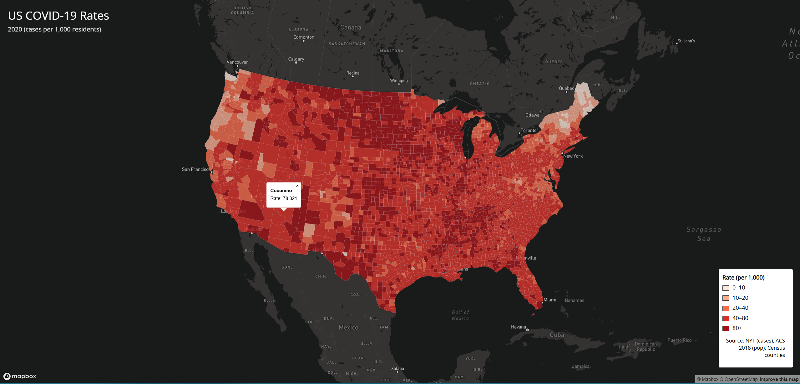
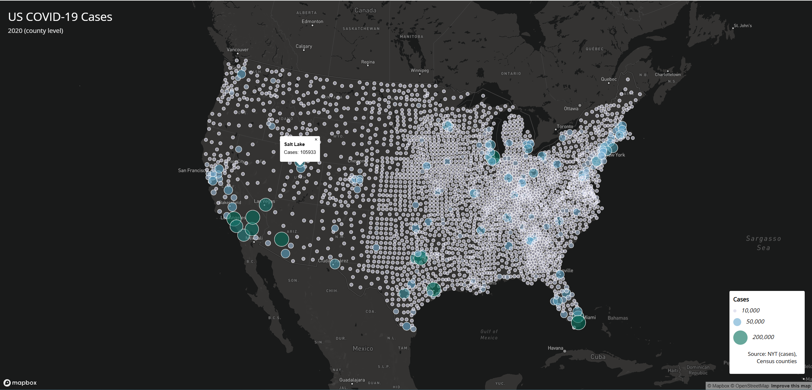

# GEOG 458 Lab 3 – COVID-19 Web Maps

This project presents two interactive web maps visualizing COVID-19 data in the United States (2020) using Mapbox GL JS.

## Map 1: Choropleth Map (COVID-19 Rates)
This map shows county-level COVID-19 case rates (cases per 1,000 residents) using a choropleth representation with an Albers projection.

## Map 2: Proportional Symbol Map (COVID-19 Cases)
This map displays total COVID-19 cases by county using proportional circle symbols. Larger and darker circles indicate higher case counts.

## Features
- Albers projection for U.S.-wide mapping
- Interactive popups showing county-level information
- Legends for both choropleth and proportional symbol maps

## Data Sources
- COVID-19 case and death data: The New York Times
- Population data: ACS 2018 5-year estimates
- County boundaries: U.S. Census Bureau

## Libraries
- Mapbox GL JS

